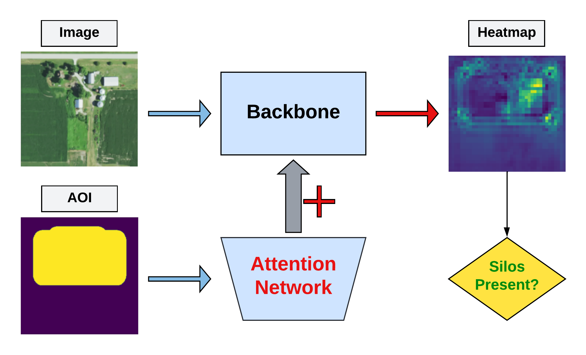

🎉<b>ESA NoR website has just published our report</b> for the sponsored project "Time series analysis of Lebanese crops" <a href="./TimeSeriesAnalysisofLebaneseCrops_2021.pdf" target=_blank>[Report]</a>. 

<b><h2 id=winter-wheat>Lebanese winter wheat monitoring</h2></b>

In recent years, remote sensing and deep learning have emerged as new technologies that can play a crucial role in future agriculture and global food productivity. They are new efficient ways that should help farmers to automate many tasks, including plant/crop identification. Combining remote sensing and deep learning models should provide instantaneous information about crop type and status. Therefore, these new technologies can be considered as a fundamental base for many smart farming applications, including crop yield estimation, crop surveying/monitoring, thus, leading to crop production management, cost reduction, and save a lot of time providing precious information that should help the farmers and decision makers to make instant decisions. In this project, we focus on Lebanese winter wheat parcels yearly mapping from Sentinel-2 images <a href="https://geogroup.ai/publication/2023ECRS_PEFTWheat/">[Paper]</a> [APP](https://www.wasdi.net/#!/wheat_locator/appui) <em>(requires WASDi account)</em>
[APP Docs](https://wasdi.readthedocs.io/en/latest/WasdiApplications/WheatLocator.html).

<b><h2 id=silos>Grain Bins</h2></b>

Missing paragraph.

<b><h2 id=nasas>Field Boundary Detection</h2></b>

Small farms produce about 35% of the world’s food, and are mostly found in low- and middle-income countries. Mapping these farms allows policy-makers to allocate resources and monitor the impacts of extreme events on food production and food security. In this NASA Harvest challenge, the goal is to classify crop field boundaries in Rwanda’s Eastern Province. GEOAI group ranked 4th in the “NASA Harvest Field Boundary Detection Challenge” out of 730 participants <a href="https://github.com/geoaigroup/nasa_harvest_boundary_detection_challenge" target=_blank>[Code]</a>.

